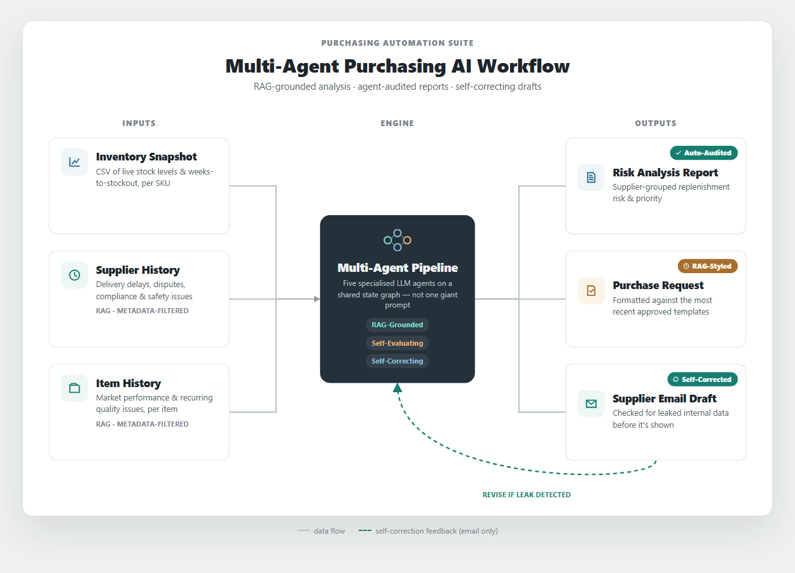
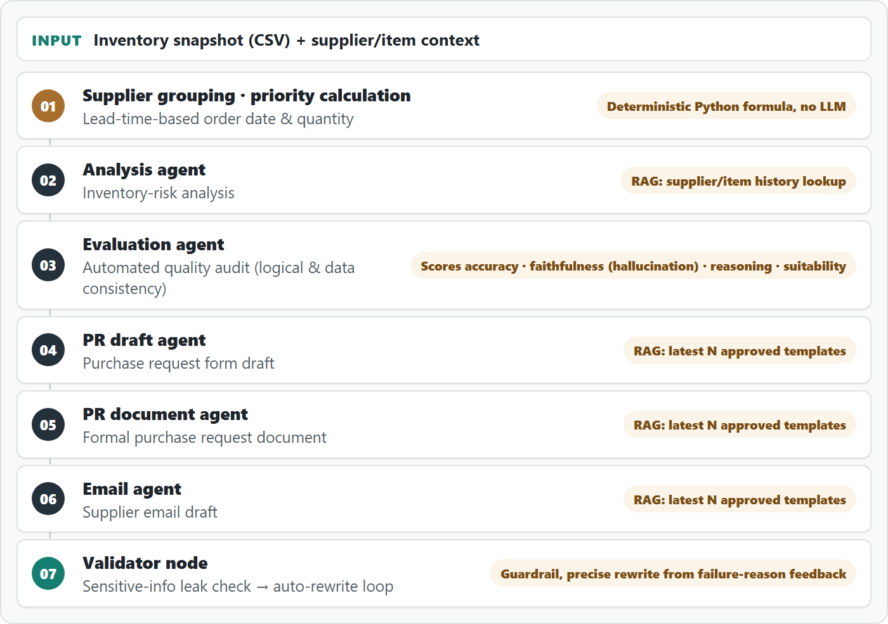

# Multi-agent Purchasing AI Suite

A multi-agent LLM pipeline that jointly analyzes an inventory snapshot together with supplier and item history context via RAG, automating the manual work previously handled by purchasing staff — **from inventory-risk analysis and replenishment planning to drafting analysis reports, purchase request forms, and supplier emails**.

*Rather than stopping at a simple stock check, it uses RAG to automatically retrieve and analyze relevant context scattered across many documents, including supplier delivery performance and delay history, transaction and negotiation records, customs/regulatory/safety issues, item market performance, and item-specific issue history.* Each output is then **independently audited by a separate agent for data and logical consistency, producing a quality-evaluation report alongside it**. The email draft also goes through a **self-correction loop that checks for internal information leakage and rewrites the draft if any risk is found**.



> **Demo:** https://soominmyung.com/purchasing-automation
>
> **Source:** https://github.com/soominmyung/purchasing-automation

> A polished A4 version of this write-up is available as a [PDF](docs/portfolio_a4_en.pdf).

---

## At a Glance

<table>
<tbody>
<tr><td><b>Period</b></td><td>Oct 2025 – Dec 2025</td></tr>
<tr><td><b>Role</b></td><td>Solo project — architecture, development, deployment</td></tr>
<tr><td><b>Domain</b></td><td>Generative AI-based inventory-risk analysis &amp; automated document generation</td></tr>
<tr><td><b>Core stack</b></td><td>Python, FastAPI, LangGraph, ChromaDB, GPT-4o, Docker, GCP Cloud Run</td></tr>
<tr><td><b>Starting point</b></td><td>n8n low-code prototype → re-architected as a Python service</td></tr>
</tbody>
</table>

---

## The Problem

Purchasing staff review hundreds of SKU-level inventory records and, on that basis, spend considerable manual effort writing documents such as analysis reports, purchase request forms, and supplier emails.

The challenge is that this process is **highly dependent on staff availability and experience**. **When time pressure or limited familiarity with a supplier or item prevents a full review** of evidence scattered across many documents — a supplier's delivery and quality history, past negotiation terms, customs/regulatory/safety issues, and an item's market performance — **the result can be inefficient ordering and potential margin loss**.

## What It Does

Given an inventory snapshot, the system automatically produces four outputs.

1. **Purchasing analysis report** — supplier-grouped inventory-risk assessment and replenishment planning
2. **Quality-evaluation report** — a separate agent audits the analysis for data and logical consistency
3. **Purchase request form (PR)** — formatted per supplier for the approval process
4. **Supplier email draft** — outbound communication for delivery and stock-availability inquiries

The inventory snapshot is provided as a CSV of items flagged for potential shortage, while supplier and item history documents are uploaded, embedded into a vector DB, and then automatically retrieved during the analysis stage.

---

## Architecture

### PoC-to-Production — from n8n prototype to production code

I first validated the concept quickly with an **n8n** low-code workflow. By wiring nodes together, this stage confirmed the feasibility of the "CSV → grouping → LLM analysis → document generation" flow.

Once validated, I re-architected the entire workflow in **Python (FastAPI + LangGraph)** to implement complex branching logic, state management, and container deployment. In the process I moved the node-based flow onto an async API and a state graph, refined it into a deployable service with API-key authentication and streaming, and set up CI/CD (GitHub Actions → Cloud Run) for the public demo (actual operations run on the company's local server).

### Multi-agent pipeline (LangGraph)

Five specialized agents are connected as a LangGraph state graph, and the validator node loops back to an earlier step to rewrite when needed.



**Why multi-agent?**

Compared to handling everything with a single monolithic prompt, this design offers:

- **Modularity** — each step can be swapped or improved independently without touching the others; in practice, I isolated just the analysis agent to test replacing GPT-4o with a self-hosted Llama-3-8B model.
- **Early error containment** — because the evaluation agent independently audits the analysis, a flawed analysis is caught before it propagates into the downstream steps (PR, email).
- **Precise self-correction and validation** — when the validator node detects a problem, it can pinpoint exactly which step needs a rewrite instead of re-running the entire pipeline from scratch.

### Core Components

**RAG knowledge base (ChromaDB)**

- **Pipeline** — supplier-record and item-history PDFs (uploaded individually or in bulk as ZIP) are chunked (1,000 chars, 200-char overlap), converted to OpenAI embeddings, and stored in five independent collections split by document type (supplier history, item history, and report/PR/email examples).
- **Empirical hyperparameter tuning — deciding the chunk size** — reviewing the actual supplier/item history documents, I found they typically run about 1–2 A4 pages, and used that as the basis to benchmark chunk sizes of 500, 1,000, and 1,500 characters for storage/retrieval efficiency. Too small (500) and a single event's narrative (cause → effect) gets cut at a chunk boundary, breaking context; too large (1,500) and several distinct events get mixed into one chunk, blurring the embedding so it can't focus on any one event. I settled on 1,000 characters as the best fit for the event-level narrative length of the source documents, and set the overlap to 200 characters (20% of chunk size) so that an event straddling a boundary is still captured in both adjacent chunks.
- **Workflow-tailored design** — the actual supplier/item history documents followed a convention of stating the supplier name and item code at the top. Recognizing this, I could extract **reliable metadata with regex alone**, without any complex ontology implementation.
    - **Metadata tagging** — at ingest time, regex extracts the supplier name and item code and attaches them as document metadata. Since every child chunk inherits the parent document's metadata after chunking, the filter always applies correctly even when a given chunk's text doesn't literally contain that name.
    - **Explicit metadata filtering + similarity search (two-stage retrieval)** — when the analysis agent looks up history, it doesn't rely solely on the LLM-generated query text; it also passes the actual supplier name and item code the pipeline already knows as a metadata filter. It first narrows the candidate set to documents satisfying that filter, then ranks by similarity within that set to fetch the top K — so the result is not "semantically similar documents" but precisely "the most semantically relevant among the documents that actually belong to that supplier/item."
    - **Strength** — pure semantic similarity search risks pulling in similar narratives from other suppliers (e.g. comparable shipping-delay cases), but the metadata filter blocks this cross-contamination at the source — and it does so without any heavy structure like an ontology or knowledge graph, achieved through a single existing document-authoring convention.
- **Purpose-differentiated retrieval strategy** — supplier/item history is "fact retrieval," so it uses a metadata filter + similarity ranking, whereas the best-practice templates for analysis reports/PRs/emails are "style retrieval," which is different in nature. If the company's format changes, an old example may diverge in style from the latest documents, and similarity alone cannot tell them apart. So the example collections record a timestamp at ingest time and, at retrieval time, fetch the top N by **most recently uploaded** rather than by similarity.

**AI quality-evaluation (Evaluator) agent** — A separate evaluation agent cross-references the analysis agent's output (JSON) against the source supplier/item history it was based on, scoring it out of 10 on four criteria — **data accuracy, history faithfulness (hallucination check), logical reasoning, and operational suitability**. Because it compares against the exact history retrieved by the analysis agent — passed directly rather than re-fetched — it avoids the failure mode of misjudging a genuinely grounded statement as "unsourced" and wrongly scoring it as a hallucination.

**Guardrail — self-correction loop** — The email output passes through the validator node, which checks for internal information leakage. If a leak is detected, it is not returned as-is; the graph loops back to regenerate the draft.

**Real-time streaming (SSE)** — Instead of a single request-response, the progress of each pipeline stage (CSV parsing → grouping → analysis → document generation) is streamed to the client in real time via Server-Sent Events, showing the current pipeline stage live and surfacing errors immediately when they occur.

**Hybrid design — deterministic computation vs. LLM reasoning** — In the supplier-grouping stage, the recommended order date and quantity are **computed with a Python formula** based on `WksToOOS` (weeks to out-of-stock) and `CurrentStock`. Accuracy-critical values like dates and quantities are handled by deterministic code rather than left to LLM reasoning, eliminating hallucination risk; the LLM then takes that result and focuses solely on risk interpretation and document authoring over the prioritized, structured data.

**Security & Observability** — The public demo has header-based API-key authentication (`X-API-Key`) and per-IP rate limiting to prevent token abuse by anonymous users; the in-house deployment implements per-user intranet ID/PW login. LangSmith tracks token usage, latency, and prompt performance for every node, and custom logic outside LangChain is also instrumented with `@traceable`.

**Deployment** — The public demo runs as a Docker container on GCP Cloud Run (serverless, scale-to-zero) so anyone can access it, with CI/CD via GitHub Actions building and auto-deploying the image on every push to `main`. For actual in-house operations, the app runs continuously on the same 24/7 local server as SAP ERP, so the team uses it over the intranet — an environment with no cold-start or vector-store volatility issues.

---

## Fine-tuning Study: SFT + DPO on Llama-3-8B

I tested whether the GPT-4o analysis agent could be replaced with a self-hosted model. **The goal was to reduce per-call cost and data-exposure risk**, and the approach was to distill GPT-4o's knowledge into Llama-3-8B.

### Training data

- **Data source** — instead of real company data, I used **synthetic purchasing scenarios** generated by GPT-4o.
- **Scenario composition** — each consists of inventory rows (item code, item name, supplier, risk grade, current stock, weeks-to-out-of-stock) and supplier/item history (natural language).
- **Adversarial cases included** — I deliberately included cases like data contradictions (high stock yet imminent stockout), conflicting context (a "trusted" label vs. a recent failure), ambiguous history, and missing values, to improve robustness. A model trained on such cases, when faced with similar production cases, responds by **explicitly stating contradictions or gaps as such** rather than masking them or fabricating information.
- **Knowledge distillation** — the analysis GPT-4o produced for these scenarios (JSON: analysis report, critical questions, supplementary timeline) was treated as ground truth for Llama to reproduce.
- **Fine-tuning scope** — limited to the **output of the analysis agent** being replaced, not the whole pipeline.

### Stage 1 — Supervised Fine-Tuning (SFT)

- Llama-3-8B + QLoRA (4-bit, LoRA rank 16 — ~41M trainable params / 8B, 0.51%)
- 30 teacher examples (analysis JSON GPT-4o generated per scenario)
- Vertex AI, 1× Tesla T4, 5 epochs, 367s — training loss 1.14 → 0.41
- Artifact: `gs://purchasing-automation-models/sft-runs/lora_adapter/` · [W&B](https://wandb.ai/msm1640-/purchasing-automation-sft)

### Stage 2 — Direct Preference Optimization (DPO)

- 25 preference pairs (holdout of 5 excluded). `chosen` is fixed to the GPT-4o ground-truth analysis JSON, and `rejected` is selected by having the SFT model generate 4 candidates per prompt at temperature 0.8, scoring them with a GPT-4o judge, and **taking only the lowest-scoring one**. The judge was instructed to evaluate only data accuracy and reasoning quality — not style — so that stylistic differences would not leak into the preference signal.
- Vertex AI, Tesla T4, 3 epochs, ~14 min · Unsloth `PatchDPOTrainer()` + TRL `DPOTrainer`
- Artifact: `gs://purchasing-automation-models/dpo-runs/lora_adapter/` · [W&B](https://wandb.ai/msm1640-/purchasing-automation-dpo)

### Evaluation (GPT-4o-as-judge, 5-example holdout)

Two criteria scored 1–10 each (data accuracy, reasoning quality) and averaged, against GPT-4o ground truth as reference.

| Model | Avg. score | Valid JSON |
|:---|:---:|:---:|
| Base Llama-3-8B | 0.0 / 10 | 0% |
| **Llama-3-8B SFT** | **9.5 / 10** | **100%** |
| Llama-3-8B SFT + DPO | 8.5 / 10 | 100% |
| GPT-4o (reference) | 10.0 / 10 | 100% |

- **SFT** reached about **95% of GPT-4o's quality** with valid structured output on every example — validating self-hosted-model feasibility.
- **DPO regressed** (9.5 → 8.5) despite judge-verified preference pairs. Root cause: most regressed examples dropped the `critical_questions` field, even though `chosen` includes it in all 25 cases and `rejected` in only 7 — DPO's contrastive learning adjusts the whole-sequence probability and cannot pinpoint *which part* is responsible (a lack of **credit assignment**), so a few noisy exceptions drove generalization the wrong way at this small sample size.
- **Conclusion:** at this scale (25 pairs), **SFT alone** is the more reasonable choice; the remaining 5% gap does not justify the extra engineering (multi-attribute reward, or Best-of-N filtering + SFT) that a robust DPO retry would require.

---

## Tech Stack

* **Backend**: Python, FastAPI (async, SSE streaming)
* **Orchestration**: LangGraph (state-based multi-agent), LangChain, LangSmith (LLMOps)
* **LLM**: GPT-4o / GPT-4o-mini → fine-tuned Llama-3-8B (QLoRA)
* **Fine-tuning**: Unsloth + TRL (SFTTrainer / DPOTrainer), QLoRA (4-bit), Vertex AI Custom Training, W&B
* **Vector DB**: ChromaDB (RAG)
* **Frontend**: React, TypeScript, Framer custom code components
* **Data processing**: Pandas, PyPDF, python-docx
* **Infra / CI-CD**: Docker, GCP Cloud Run, Vertex AI, Artifact Registry, GitHub Actions

---

## Local Setup & Quick Start

Get the project running locally with Docker.

**1. Clone the repository**
```bash
git clone https://github.com/soominmyung/purchasing-automation.git
cd purchasing-automation
```

**2. Set environment variables**
```bash
cp .env.example .env
```
Open `.env` and add your `OPENAI_API_KEY`. You can also set a custom `API_ACCESS_TOKEN` for header-based authentication.

**3. Run with Docker**
```bash
docker build -t purchasing-ai .
docker run -p 8080:8080 --env-file .env purchasing-ai
```
The API is then available at `http://localhost:8080`, with interactive docs at `http://localhost:8080/docs`.

---

## Project Structure

* **main.py** — FastAPI entry point; **config.py** / **schemas.py** — settings & request/response models
* **routers/** — API layer (pipeline, ingest, output)
* **services/** — business logic (AI agents, vector store, security, grouping)
* **utils/** — utilities (CSV parsing, PDF extraction, Word generation)
* **scripts/** — fine-tuning pipeline (`train_sft.py`, `train_dpo.py`, `generate_dpo_pairs.py`, `eval_sft.py`, `eval_dpo.py`) and Vertex AI job submission
* **training_data/** — GPT-4o-distilled teacher dataset (JSONL)
* **docs/** — documentation, portfolio write-up, and sample dataset (Examples.zip)
* **.github/workflows/deploy.yml** — CI/CD pipeline configuration
* **Dockerfile** — containerization config for Cloud Run (port 8080)
