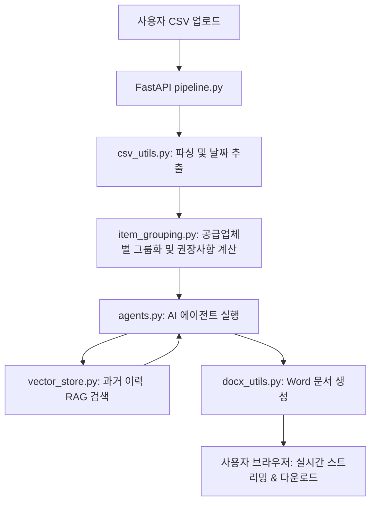

# 구매 자동화 프로젝트 (Purchasing Automation Suite) 프로젝트 개요 및 파일 분석

이 프로젝트는 기업용 재고 데이터(CSV)를 분석하여 구매 분석 보고서, 구매 요청서(PR), 공급업체 이메일 초안을 자동으로 생성하는 **엔터프라이즈급 AI 솔루션**입니다. FastAPI 백엔드와 LangChain 멀티 에이전트 아키텍처를 기반으로 하며, 실제 운영 환경을 고려한 보안 및 스트리밍 기능이 포함되어 있습니다.

---

## 📂 프로젝트 구조 및 파일 설명

### 1. Root Directory (핵심 설정 및 실행)
*   **[main.py](file:///c:/Users/msm16/바탕 화면/purchasing_automation/main.py)**: FastAPI 애플리케이션의 진입점(Entry Point)입니다. CORS 설정, API 라우터 등록, 앱 시작 시 벡터 스토어 초기화 등의 작업을 수행합니다.
*   **[config.py](file:///c:/Users/msm16/바탕 화면/purchasing_automation/config.py)**: 환경 변수(`.env`) 및 시스템 설정을 관리합니다. OpenAI API 키, 보안 토큰, 벡터 스토어 설정 등을 포함합니다.
*   **[schemas.py](file:///c:/Users/msm16/바탕 화면/purchasing_automation/schemas.py)**: API 입출력 및 AI 에이전트 간 데이터 전달에 사용되는 Pydantic 데이터 모델을 정의합니다.
*   **[Dockerfile](file:///c:/Users/msm16/바탕 화면/purchasing_automation/Dockerfile)**: 가상 환경 구축을 위한 도커 설정 파일입니다.
*   **[requirements.txt](file:///c:/Users/msm16/바탕 화면/purchasing_automation/requirements.txt)**: 프로젝트 실행에 필요한 Python 라이브러리 목록입니다.
*   **[README.md](file:///c:/Users/msm16/바탕 화면/purchasing_automation/README.md)**: 프로젝트의 기술 스택, 주요 기능 및 구조에 대한 종합 가이드입니다.

### 2. Routers (API 계층)
*   **[routers/pipeline.py](file:///c:/Users/msm16/바탕 화면/purchasing_automation/routers/pipeline.py)**: 프로젝트의 핵심 워크플로우를 담당합니다. CSV 업로드부터 아이템 그룹화, AI 분석, 최종 문서 생성까지의 전 과정을 오케스트레이션하며, SSE(Server-Sent Events)를 통해 실시간 진행 상황을 클라이언트에 스트리밍합니다.
*   **[routers/ingest.py](file:///c:/Users/msm16/바탕 화면/purchasing_automation/routers/ingest.py)**: 과거 공급업체 이력이나 아이템 히스토리 등의 PDF 문서를 업로드하여 벡터 데이터베이스(Vector Store)에 저장하는 API를 제공합니다. ZIP 파일 업로드를 통한 대량 처리를 지원합니다.
*   **[routers/output.py](file:///c:/Users/msm16/바탕 화면/purchasing_automation/routers/output.py)**: 생성된 Word(.docx) 문서의 목록 조회 및 다운로드 기능을 담당합니다. 임시 저장된 파일의 자동 삭제 로직을 포함합니다.

### 3. Services (비즈니스 로직 및 AI)
*   **[services/agents.py](file:///c:/Users/msm16/바탕 화면/purchasing_automation/services/agents.py)**: 5개의 특화된 AI 에이전트(분석, 보고서, PR 초안, PR 문서, 이메일)를 구현합니다. 각 에이전트는 LangChain을 사용하여 도구를 활용하거나 과거 데이터를 참고합니다.
*   **[services/item_grouping.py](file:///c:/Users/msm16/바탕 화면/purchasing_automation/services/item_grouping.py)**: CSV 데이터를 공급업체별로 그룹화하고, 리드 타임(Lead Time)을 고려하여 권장 발주 일자 및 권장 수량을 계산하는 정교한 비즈니스 로직을 수행합니다.
*   **[services/prompts.py](file:///c:/Users/msm16/바탕 화면/purchasing_automation/services/prompts.py)**: 각 AI 에이전트가 수행해야 할 역할과 출력 형식을 규정한 시스템 프롬프트를 관리합니다.
*   **[services/vector_store.py](file:///c:/Users/msm16/바탕 화면/purchasing_automation/services/vector_store.py)**: ChromaDB를 사용하여 과거 이력 및 예시 문서를 저장하고 검색하는 RAG(Retrieval Augmented Generation) 기능을 구현합니다.
*   **[services/security.py](file:///c:/Users/msm16/바탕 화면/purchasing_automation/services/security.py)**: API Key 인증 및 IP 기반 일일 요청 횟수 제한(Rate Limiting)을 통해 API 남용을 방지합니다.

### 4. Utils (유틸리티 및 헬퍼)
*   **[utils/csv_utils.py](file:///c:/Users/msm16/바탕 화면/purchasing_automation/utils/csv_utils.py)**: CSV 파일 파싱, 컬럼 명칭 유연 매칭, 파일명에서의 날짜 추출 기능을 제공합니다.
*   **[utils/docx_utils.py](file:///c:/Users/msm16/바탕 화면/purchasing_automation/utils/docx_utils.py)**: AI가 생성한 마크다운/텍스트 데이터를 실제 Word 파일(.docx)로 변환하고 저장합니다. 메모리 기반 생성 및 스트리밍 다운로드를 지원합니다.
*   **[utils/pdf_utils.py](file:///c:/Users/msm16/바탕 화면/purchasing_automation/utils/pdf_utils.py)**: 업로드된 PDF 문서에서 텍스트를 추출하는 기능을 담당합니다.

### 5. Frontend (사용자 인터페이스)
*   **[framer.tsx](file:///c:/Users/msm16/바탕 화면/purchasing_automation/framer.tsx)**: Framer용 React 코드 컴포넌트입니다. 사용자가 CSV를 업로드하고 실시간 진행 상황을 보며 생성된 문서를 즉시 다운로드할 수 있는 고급 UI를 구현합니다. 폴더 드래그 앤 드롭을 통한 지식 베이스(PDF) 학습 기능도 포함하고 있습니다.

---

## 🔄 주요 아키텍처 흐름

이 프로젝트는 단순히 LLM을 호출하는 것을 넘어, **데이터 전처리(CSV) -> 로직 계산(Grouping) -> 문맥 보강(RAG) -> 문서화(Word Generation)**로 이어지는 전문적인 구매 자동화 파이프라인을 구축하고 있습니다.
